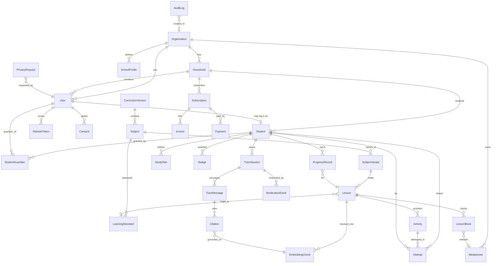
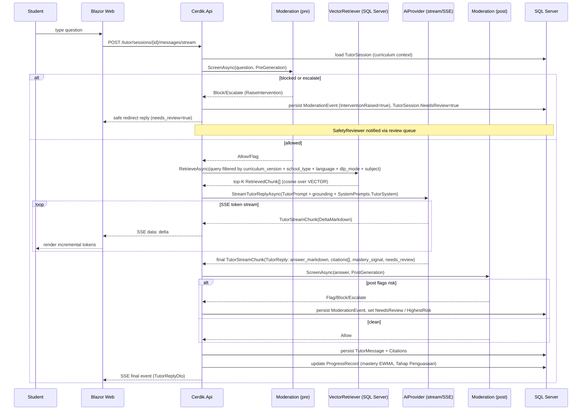

# Architecture

cerdikMY is a layered .NET 10 solution (`CerdikMY.sln`) with a strict, one-direction
dependency flow. The Domain layer has no dependencies; everything else depends
inward toward it.

## Layered project structure

```
Cerdik.Domain          Entities + enums + BaseEntity. No external dependencies.
   ▲
Cerdik.Application      DTOs, abstractions (interfaces), AI contracts, system
   ▲                    prompts, feature flags, Result/PagedResult. Depends only
   │                    on Domain. Defines IAiProvider, IStorageService,
   │                    IVectorRetriever, IModerationService, IPaymentProvider, etc.
Cerdik.Infrastructure   Concrete implementations: EF Core 10 DbContext + mappings,
   ▲                    SQL Server VECTOR retriever, S3/Azure storage, AI adapters
   │                    (OpenAI/Azure/Anthropic/mock), payment providers, email,
   │                    token + password services. Depends on Application + Domain.
   ├──────────────┬──────────────┐
Cerdik.Api      Cerdik.Web     Cerdik.Worker
ASP.NET Core    Blazor Web     Hangfire host (SQL Server storage).
Web API.        App.           Runs embedding indexing, export bundle
Controllers,    Calls the      generation, anonymization, billing
JWT, SSE,       API.           reconciliation.
Hangfire
dashboard.
```

- **Cerdik.Domain** — the 28 core entities plus supporting `RefreshToken`,
  `StudyPlan`, `Badge`, `PrivacyRequest`. `BaseEntity` provides `Id`
  (`Guid.CreateVersion7()`), `CreatedAt`, `UpdatedAt` and a nullable `DeletedAt`
  soft-delete marker. `ITenantScoped` marks entities owned by an `Organization`.
- **Cerdik.Application** — the contract surface. Application services return
  `Result<T>` for expected domain errors and `PagedResult<T>` for lists. All
  vendor integration is hidden behind interfaces here.
- **Cerdik.Infrastructure** — implements those interfaces. The EF Core DbContext
  maps `EmbeddingChunk.Embedding` (`float[]`) to a SQL Server `VECTOR(N)` column,
  with `EmbeddingJson` as a portable fallback for instances/providers without the
  native type (cosine similarity then computed in-app).
- **Cerdik.Api** — minimal hosting + controllers, JWT bearer auth, httpOnly
  refresh-cookie rotation, the SSE tutor endpoint, and the Hangfire dashboard at
  `/hangfire`. Auto-applies migrations and seeds on startup.
- **Cerdik.Web** — Blazor Web App consuming the API.
- **Cerdik.Worker** — Hangfire jobs host backed by SQL Server storage.

## Entity-relationship diagram



## AI tutor request flow



The non-streaming variant (`POST /tutor/sessions/{id}/messages`) runs the same
pipeline via `GenerateTutorReplyAsync` and returns a single `TutorReplyDto`.

## RBAC model

Authorization is role-based, driven by `UserRole` carried in the JWT and surfaced
through `ICurrentUser` (`IsAuthenticated`, `UserId`, `OrganizationId`, `StudentId`,
`Role`, `IsInRole(params UserRole[])`).

| Role | Capabilities |
| --- | --- |
| **Parent** | Manage own household, students, study plans, subscriptions; view children's progress and AI flags; open tutor sessions on behalf of a child. |
| **Student** | Log in (guardian-provisioned), do lessons/activities, use the AI tutor, view own progress. Scoped to a single `Student`. |
| **Admin** | Full platform admin: user management, content, analytics, billing/webhook logs. |
| **ContentAdmin** | Author/import lessons and publish content (`POST /admin/content/import`, `/publish`). |
| **SafetyReviewer** | Work the moderation queue: review escalations/interventions, resolve `ModerationEvent`s. |

Tenancy: `ITenantScoped` entities (User, Household, Student, SchoolProfile,
MediaAsset) are always filtered by `OrganizationId`, enforced from
`ICurrentUser.OrganizationId`.

## Feature flags (language & DLP rollout)

Language and DLP variants roll out in stages via a dependency-free flag system
(`Cerdik.Application/Features/FeatureFlags.cs`). Defaults live in code; overrides
come from the `FEATURE_FLAGS` env var (`"lang.zh=true,dlp.math=false"`), parsed by
`FeatureFlags.Parse`.

Conservative defaults: `lang.bm` and `lang.en` ship **on**; `lang.zh`, `lang.ta`,
`dlp.science` and `dlp.math` ship **off** (gated). `billing.curlec` and
`tutor.streaming` default on.

- `IFeatureFlags.LanguageEnabled("zh")` → checks `lang.zh`. Gates whether ZH/TA
  `SubjectVariant`s and tutor languages are exposed.
- `IFeatureFlags.DlpEnabled("science")` → checks `dlp.science`. Gates DLP subject
  variants (`DlpMode.DlpSubjectVariant`).
- `MeResponse.Features` returns the resolved flag snapshot so the Blazor UI can
  hide gated languages/DLP toggles without a redeploy.

## Initial SQL indexes

Performance-sensitive indexes applied by the initial migration. The
`EmbeddingChunk` filter columns mirror the RAG retrieval predicate
(curriculum_version + school_type + language + dlp_mode + subject), and the vector
column carries a native `VECTOR` index for ANN search (with the in-app cosine
fallback for instances without it).

```sql
-- RAG retrieval filter (covers the curriculum-scoped predicate)
CREATE INDEX IX_EmbeddingChunk_Filter
    ON EmbeddingChunk (CurriculumVersionCode, SubjectId, SchoolType, Language, DlpMode, Approved)
    INCLUDE (LessonId, ChunkIndex, Dimensions);

-- Native vector index for approximate nearest-neighbour search over embeddings
CREATE VECTOR INDEX VX_EmbeddingChunk_Embedding
    ON EmbeddingChunk (Embedding)
    WITH (METRIC = 'cosine', TYPE = 'diskann');

-- Learner activity history
CREATE INDEX IX_Attempt_StudentId
    ON Attempt (StudentId)
    INCLUDE (ActivityId, Status, SubmittedAt, PercentScore);

-- Progress roll-up lookups (per student + subject)
CREATE INDEX IX_ProgressRecord_StudentId_SubjectId
    ON ProgressRecord (StudentId, SubjectId)
    INCLUDE (LessonId, MasteryScore, TahapPenguasaan, Completed);

-- Tutor session message timeline
CREATE INDEX IX_TutorMessage_TutorSessionId
    ON TutorMessage (TutorSessionId)
    INCLUDE (Role, CreatedAt);

-- Audit log time-range scans
CREATE INDEX IX_AuditLog_CreatedAt
    ON AuditLog (CreatedAt);

-- Login by email (unique)
CREATE UNIQUE INDEX UX_User_Email
    ON [User] (Email)
    WHERE DeletedAt IS NULL;

-- Lesson listing by variant + publish state
CREATE INDEX IX_Lesson_SubjectVariantId_State
    ON Lesson (SubjectVariantId, State)
    INCLUDE (Slug, Title, SortOrder);
```
