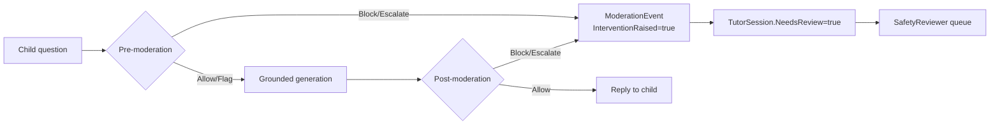

# Privacy & safety

cerdikMY serves children and families, so privacy and child safety are
first-class. This document covers the PDPA-aligned data-subject lifecycle
(consent, export, delete/anonymize), child-safety controls, audit logging, data
minimisation and retention, and the explicit copyright rule.

> Related: [ai-tutor.md](ai-tutor.md) (age-safe prompts + two-stage moderation in
> depth) and [architecture.md](architecture.md) (entity model, RBAC, soft-delete
> `BaseEntity`).

---

## 1. PDPA alignment

cerdikMY is designed against Malaysia's **Personal Data Protection Act (PDPA)**
principles: consent, purpose limitation, data minimisation, retention limits,
and data-subject rights (access/export and erasure). Guardians act on behalf of
child data subjects.

### Consent capture (`Consent` / `ConsentType`)

Consent is recorded per purpose as `Consent` rows (`src/Cerdik.Domain/Entities/
Identity.cs`), granted by a `User` (the guardian). The purposes are the
`ConsentType` enum:

| `ConsentType` | Covers |
| --- | --- |
| `DataProcessing` | Core processing of account + learner data (required to use the platform). |
| `AiTutoring` | Use of the grounded AI tutor (questions/answers, moderation screening). |
| `Marketing` | Optional product / marketing communications. |
| `MediaCapture` | Capturing learner media (uploads/recordings) where applicable. |

Consent is captured at sign-up and is revocable; consent grants and revocations
are written to the audit log (§4). AI-tutoring features are gated on the
`AiTutoring` consent.

---

## 2. Data-subject requests — export & delete/anonymize

Data-subject requests are modelled as `PrivacyRequest` rows
(`src/Cerdik.Domain/Entities/Operations.cs`) and worked asynchronously by
Hangfire jobs in `src/Cerdik.Worker`.

```csharp
public class PrivacyRequest : BaseEntity
{
    public Guid RequestedByUserId { get; set; }
    public Guid? StudentId { get; set; }            // scope to one learner, optional
    public PrivacyRequestType Type { get; set; }     // Export | Delete
    public PrivacyRequestStatus Status { get; set; } // Received -> Processing -> Completed | Rejected
    public string? Reason { get; set; }
    public string? ResultStorageKey { get; set; }    // export bundle location
    public DateTimeOffset? CompletedAt { get; set; }
}
```

`PrivacyRequestStatus` flows `Received → Processing → Completed` (or `Rejected`).

### 2.1 Export (`PrivacyRequestType.Export`)

A guardian requests an export of their household / a child's data. The worker:

1. Sets `Status = Processing`.
2. Generates an export bundle (account, household, learner profile, progress,
   tutor history, consents) and writes it to object storage via
   `IStorageService`.
3. Stores the bundle location in `ResultStorageKey`, sets `Status = Completed`
   and `CompletedAt`.

Export bundles are themselves personal data — they live behind authenticated,
expiring access and are subject to the retention rules in §5.

### 2.2 Delete / anonymize (`PrivacyRequestType.Delete`)

Erasure is a two-layer operation:

- **Soft-delete first.** Every entity derives from `BaseEntity`, which carries a
  nullable `DeletedAt` marker. Setting `DeletedAt` removes the record from normal
  queries (e.g. the unique email index is filtered `WHERE DeletedAt IS NULL`)
  while preserving referential integrity during processing.
- **Anonymize.** The worker then irreversibly strips/over-writes direct
  identifiers (name, email, contact details, free-text the child entered) so that
  retained records required for legitimate purposes — aggregate progress
  analytics, billing/financial records, and **audit logs** — no longer identify a
  person. Tutor message content tied to a child is removed or redacted.

This satisfies the right to erasure while keeping the minimal, de-identified
records the platform must retain (e.g. financial/audit obligations). The request
ends `Completed`, recorded in the audit log.

---

## 3. Child safety

Children are the primary users, so safety is enforced at multiple layers (full
detail in [ai-tutor.md](ai-tutor.md)):

- **Age-safe system prompts.** `SystemPrompts.TutorSystem(level, language,
  subject)` adapts tone per level (Preschool → Upper Secondary) and language
  (BM/EN/ZH/TA), and appends a non-negotiable `SafetyCore`: refuse unsafe/adult/
  violent/self-harm content, never collect personal/contact data, guide rather
  than hand out answers, and set `needs_review` on any sign of distress. Prompts
  are versioned (`SystemPrompts.Version`) so changes are reviewable.
- **Two-stage moderation.** Every turn is screened **before** generation (the
  child's question) and **after** generation (the model's answer) via
  `ClassifyRiskAsync` → `ModerationOutcome`. Decisions are
  `Allow / Flag / Block / Escalate`; `RiskLevel` runs `None → Critical`.
- **Intervention / escalation.** A `Block`/`Escalate` writes a `ModerationEvent`
  (`Stage`, `Decision`, `Risk`, `Categories`, `Reason`) with
  `InterventionRaised = true` and sets `TutorSession.NeedsReview = true`. The
  child receives a safe redirect, never the unsafe content.
- **SafetyReviewer queue.** The `SafetyReviewer` RBAC role works the moderation
  queue: reviewing escalations/interventions and resolving `ModerationEvent`s
  (recording `ReviewedByUserId`, `ReviewedAt`, `ReviewNotes`). Distress or
  danger signals always escalate (`High`/`Critical`) so a trusted adult can
  follow up.



---

## 4. Audit logging (`AuditLog`)

Security- and compliance-relevant actions are written to an **append-only**
`AuditLog` (`src/Cerdik.Domain/Entities/Operations.cs`):

```csharp
public class AuditLog : BaseEntity
{
    public Guid? OrganizationId { get; set; }
    public Guid? ActorUserId { get; set; }
    public string? ActorEmail { get; set; }
    public string Action { get; set; }          // e.g. consent.granted, privacy.export.completed
    public string EntityType { get; set; }
    public string? EntityId { get; set; }
    public string? Ip { get; set; }
    public string? UserAgent { get; set; }
    public string? MetadataJson { get; set; }    // JSON diff/metadata — never secrets or full PII
}
```

Logged events include consent grants/revocations, privacy-request lifecycle
(received/completed/rejected), moderation interventions, role/permission changes
and admin content actions. `MetadataJson` carries a diff or context but **never**
secrets or full PII payloads. The `IX_AuditLog_CreatedAt` index supports
time-range compliance scans. Because anonymization deliberately preserves audit
trails, audit rows are de-identified (actor references retained as IDs) rather
than deleted.

---

## 5. Data minimisation & retention

- **Minimisation.** The tutor's prompts forbid collecting personal/contact data
  from children. The RAG corpus is original lesson content, not learner PII.
  `AuditLog.MetadataJson` stores diffs, not full payloads.
- **Tenant scoping.** `ITenantScoped` entities (User, Household, Student,
  SchoolProfile, MediaAsset) are always filtered by `OrganizationId`, so data
  cannot leak across organisations.
- **Retention.** Export bundles are short-lived and expire per the retention
  policy (set Blob lifecycle rules in Azure — see
  [deployment-azure.md](deployment-azure.md) — or prune on Hostinger). Soft-deleted
  records are anonymised on the erasure path; de-identified analytics, billing and
  audit records are retained only as long as legitimately required.
- **Encryption in transit.** Public traffic terminates TLS (certbot on Hostinger,
  managed TLS on Azure Container Apps); database connections use `Encrypt=True`
  in production.

---

## 6. Copyright rule (non-negotiable)

cerdikMY contains **no copyrighted KPM textbook content**. We model the
*structure* of the curriculum — subjects, learning standards (`LearningStandard`),
mastery bands (Tahap Penguasaan TP1–TP6) — and ship **original placeholder
lessons** mapped to those standards, described in original phrasing. We never
reproduce protected textbook passages.

This rule is enforced in the AI layer as well: the tutor is grounded **only** on
the original, review-approved `EmbeddingChunk` corpus (`Approved = true`), and the
`PracticeGenerator` prompt explicitly instructs the model to *"Do NOT copy from
any textbook"* and to write fresh, KPM-aligned questions. SafetyReviewers and
ContentAdmins are responsible for keeping unverified or potentially infringing
content out of the published, retrievable corpus.
